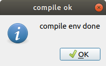
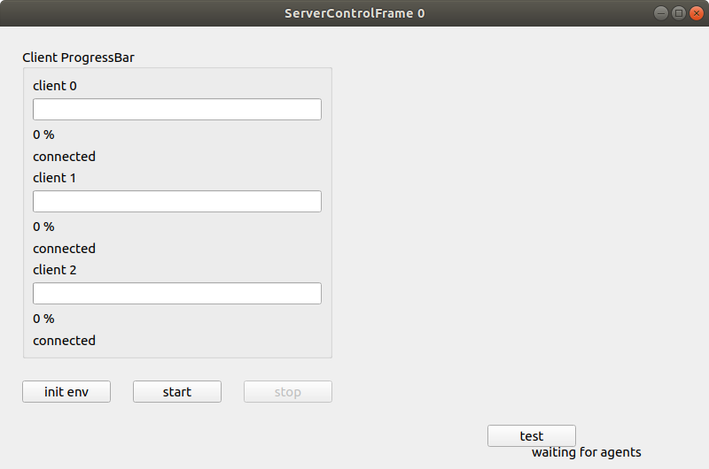
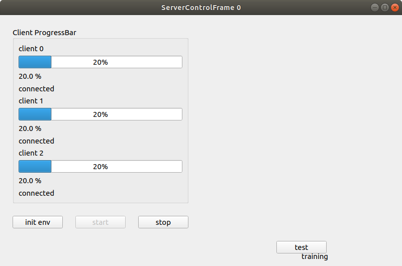
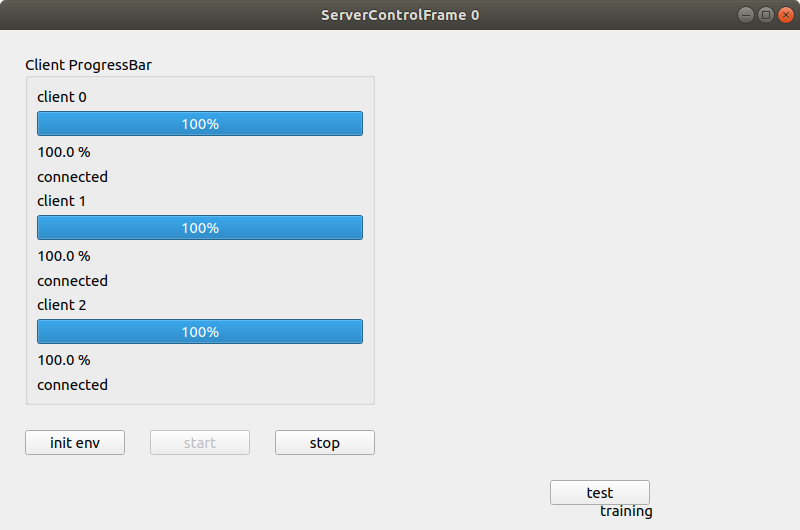
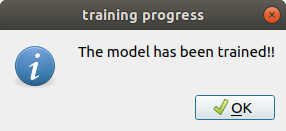

## Hi 👋

Come is come, don’t you star this project? & Forgive my pool English.

Welcome to star this repo!

Fedrated Learning-Smart Medical Introduction Video [<a href="https://www.bilibili.com/video/BV">Intro</a>]

Fedrated Learning-Smart Medical Demo Video [<a href="https://www.bilibili.com/video/BV">Demo</a>]

README [<a href="README.md">EN</a>|<a href="README_CN.md">CN</a>]

Github Page: See <a href="https://beiyuouo.github.io/paddle-fl-gui/">Here</a>

## Description

This is a simple GUI interface developed for operation by medical staff. Server parameters and client parameters can be configured in `config/config_server.yaml` and `config/config_client.yaml`

- Server main interface


- Server main control interface


- Server compilation environment prompt



- Server waiting for connection interface



- Server training interface



- Server training completion interface



- Server training completion prompt



- Client interface


- Test interface


- Test result interface


- Report generation page


<a href="https://beiyuouo.github.io/paddle-fl-gui/report/report">Online Demo</a>


## Getting start

### Installation

- Install <a href="https://paddlefl.bj.bcebos.com/redis-stable.tar">Redis</a> & <a href="https://github.com/PaddlePaddle/PaddleFL"> PaddleFL</a>
- Install requirements `pip install -r requirements.txt`


### How to run

```sh
python serverFrame.py
python clientFrame.py 0
python clientFrame.py 1
python clientFrame.py 2
```


## Change log

### v1.0(2020.11.30)
The demo open source.
