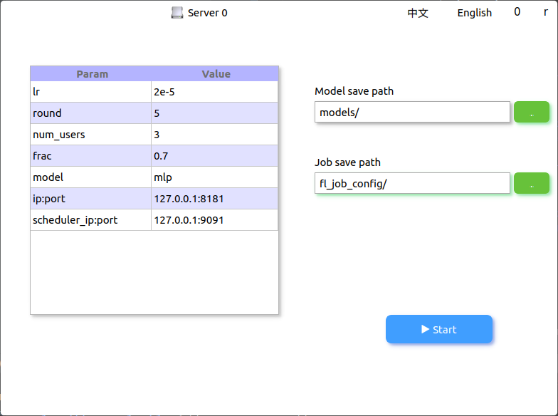
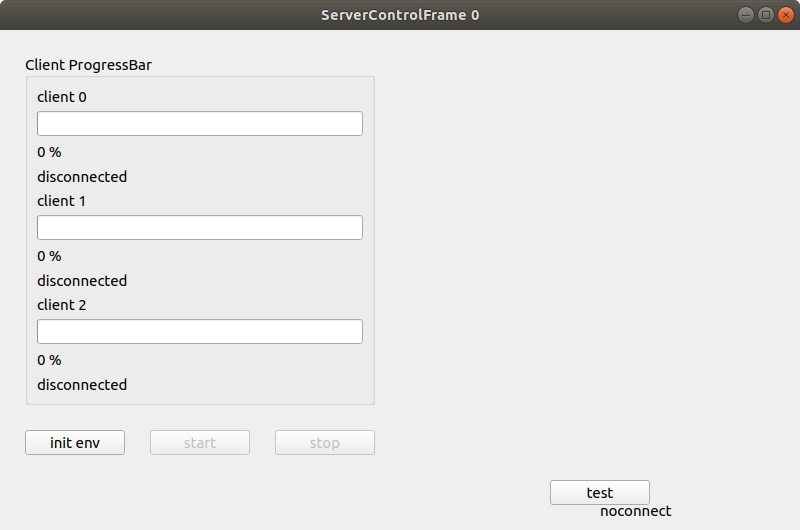
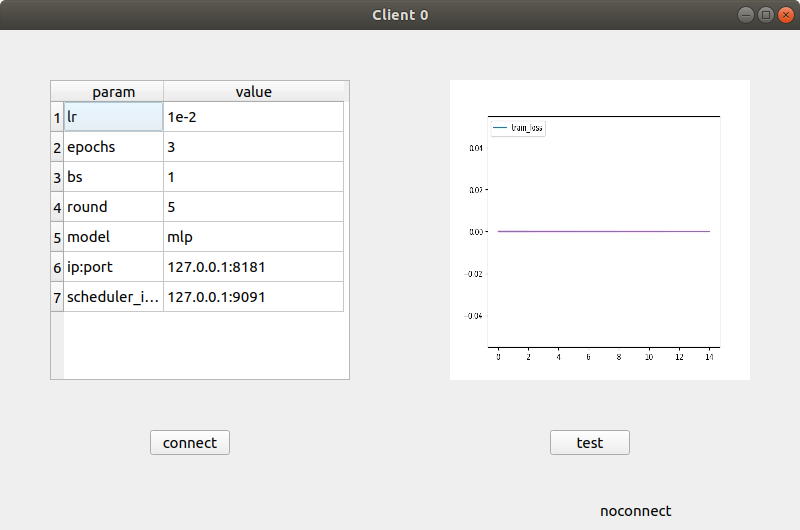
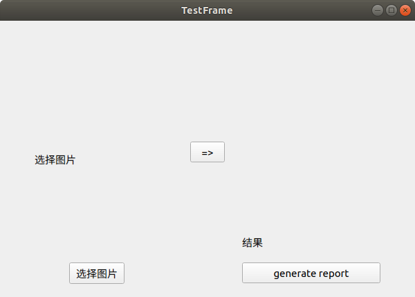
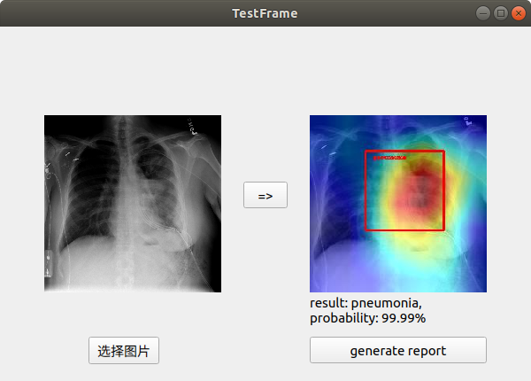
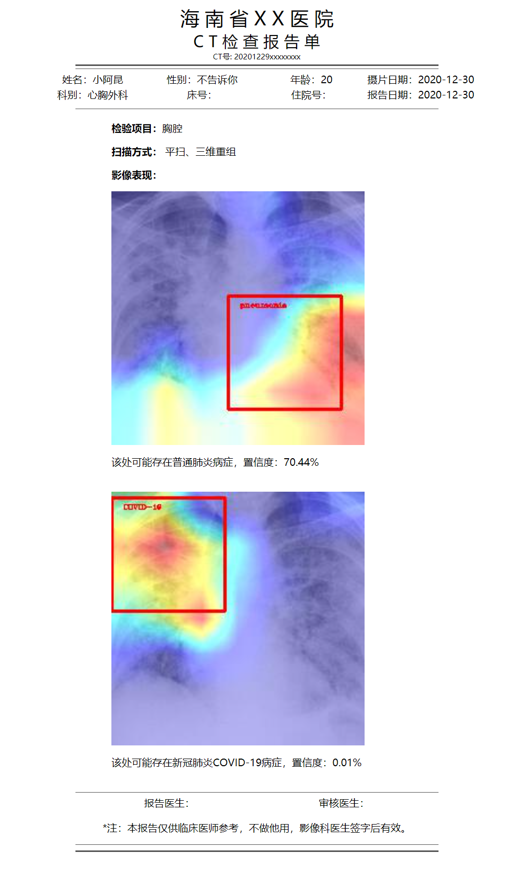

## Hi 👋

来都来了，不点个小星星吗？

Welcome to star this repo.

联邦学习-智慧医疗介绍视频 [<a href="https://www.bilibili.com/video/BV1Da4y1W7K3">Intro</a>]

联邦学习-智慧医疗演示视频 [<a href="https://www.bilibili.com/video/BV">Demo</a>]

README [<a href="README_EN.md">EN</a>|<a href="README.md">CN</a>]

Github Page: See <a href="https://beiyuouo.github.io/paddle-fl-gui/">Here</a>

## Description

这是为医护人员操作而开发的简易GUI界面，服务器参数和客户端参数可用在`config/config_server.yaml`和`config/config_client.yaml`中配置

- 服务器主界面



- 服务器主控界面



- 客户端界面



- 测试界面



- 测试结果界面



- 报告生成网页



<a href="https://beiyuouo.github.io/paddle-fl-gui/report/report">Online Demo</a>


## Getting start

### Installation

- Install <a href="https://paddlefl.bj.bcebos.com/redis-stable.tar">Redis</a> & <a href="https://github.com/PaddlePaddle/PaddleFL">PaddleFL</a>
- Install requirements `pip install -r requirements.txt`


### How to run

```sh
python serverFrame.py
python clientFrame.py 0
python clientFrame.py 1
python clientFrame.py 2
```


## Changelog

### v1.0.1_210209_beta
- 添加QSS美化界面

### v1.0.0_201130_beta
- 初代Demo开源


