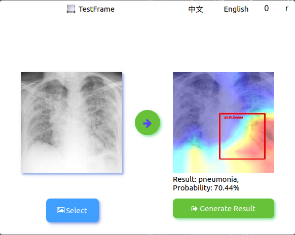
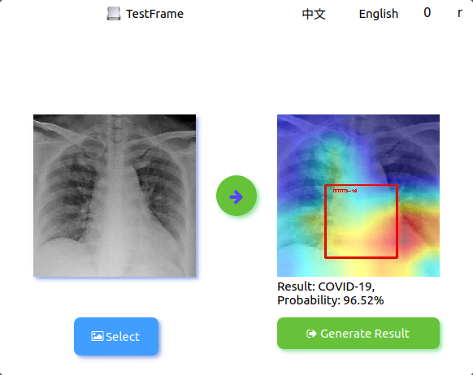
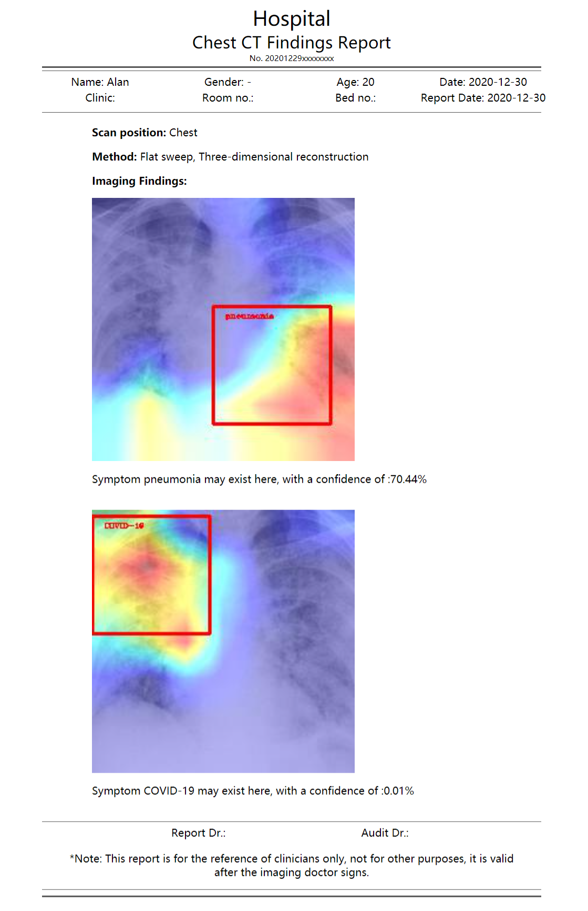

## Hi 👋

README [<a href="README.md">EN</a>|<a href="README_CN.md">CN</a>]

Github Page: See <a href="https://beiyuouo.github.io/paddle-fl-gui/">Here</a>

## Description

This is a simple GUI interface developed for operation by medical staff. Server parameters and client parameters can be configured in `config/config_server.yaml` and `config/config_client.yaml`

- Server main interface


- Server main control interface


- Client interface


- Test interface







- Report generation page



<a href="https://beiyuouo.github.io/paddle-fl-gui/report_en/report">Online Demo</a>


## Getting start

### Installation

- Install <a href="https://paddlefl.bj.bcebos.com/redis-stable.tar">Redis</a> & <a href="https://github.com/PaddlePaddle/PaddleFL"> PaddleFL</a>
- Install requirements `pip install -r requirements.txt`


### How to run

```sh
python serverFrame.py
python clientFrame.py 0
python clientFrame.py 1
python clientFrame.py 2
```


## Changelog

### v1.0.2_210210_beta
- Fix some bugs.
- Add English Report.

### v1.0.1_210209_beta
- Add qss.

### v1.0.0_201130_beta
- The demo open source.
